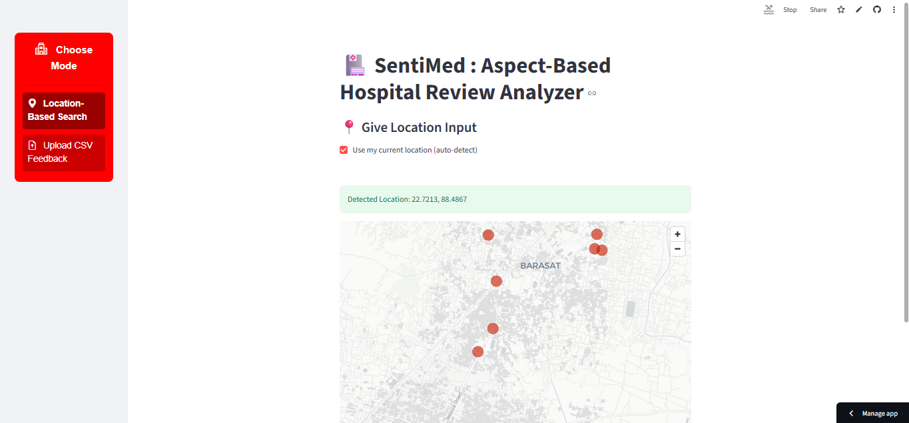
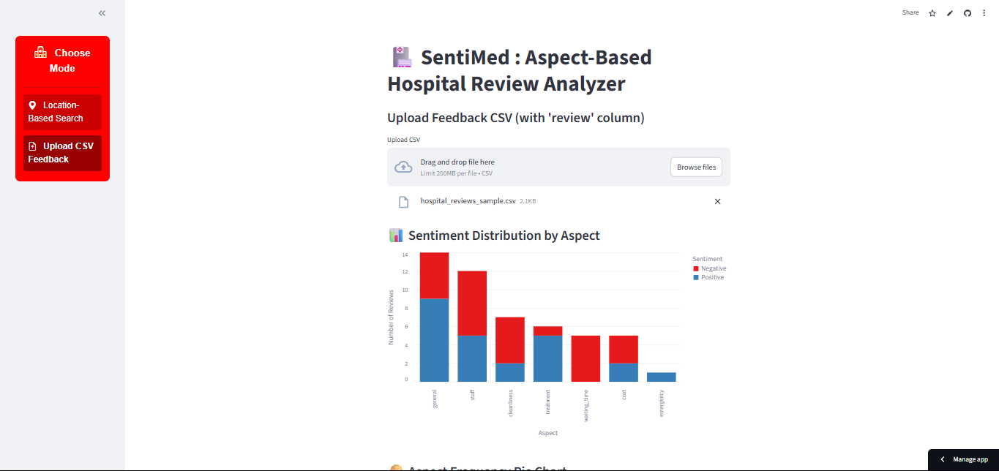

# 🏥 SentiMed – Aspect-Based Hospital Review Analyzer

**SentiMed** is an intelligent hospital feedback analysis system that uses a **Multi-Task BERT model** to extract **sentiment** and **aspect categories** from patient reviews. It offers both **location-based hospital recommendations** and **custom feedback file uploads**.

> Built with Streamlit · BERT · Hugging Face · Google Maps API

---

## 📸 App Demo

Try the live demo here 👉 [https://sentimed-hra-ak.streamlit.app/]

---

## 🌟 Features

- 🔍 **Aspect-Based Sentiment Classification**  
- 🏥 **Location-Based Hospital Search & Recommendation**  
- 📁 **CSV Upload & Analysis**  
- 📊 **Interactive Charts (Bar, Pie)**  
- ☁️ **WordCloud Generation**  
- 🗺️ **Google Maps API Integration**  
- 🧾 **Auto PDF Report Download**  
- 🧠 **Multi-Task Learning Model (Sentiment + Aspect)**  

---
## 🧠 How It Works

- **Input reviews (manually or via CSV).**

- **The BERT model predicts:**

- **Sentiment (Positive / Negative)**

- **Aspect (e.g., treatment, staff, cost)**

- **Insights are visualized using charts and word clouds.**

- **For location-based mode, the system fetches nearby hospitals using Google Maps API and ranks them based on sentiment scores.**

## 🚀 Technologies Used

| Layer         | Tools/Frameworks                                            |
|---------------|-------------------------------------------------------------|
| Web UI        | Streamlit, Altair, Matplotlib, CSS                              |
| Backend       | Python, Pandas, Numpy, Torch, Transformers (HuggingFace)   |
| Model         | Custom MultiTask BERT (`sentiment`, `aspect`)              |
| Hosting       | Streamlit Cloud, Hugging Face Hub                          |
| Maps & Location | Google Maps API, Geolocation (via JS Eval)               |
| Scraping      | **Selenium (ChromeDriver)** + BeautifulSoup                |

---

## 🧠 Model Info

The model is hosted on Hugging Face:
🔗 [amit2005/sentimed-model](https://huggingface.co/amit2005/sentimed-model)

> It's a multi-task BERT model trained on medical reviews to predict sentiment (positive/negative) and one of 7 aspects (e.g., staff, treatment, cost, cleanliness, etc.)

---

## Clone the repo
-   git clone https://github.com/amitkarmakar07/SentiMed-Hospital-Review-Analyzer.git
-   cd SentiMed-Hospital-Review-Analyzer
-   pip install -r requirements.txt

**👨‍💻 Author: @amitkarmakar07
📫 LinkedIN : https://www.linkedin.com/in/amit-karmakar-355817258/**

